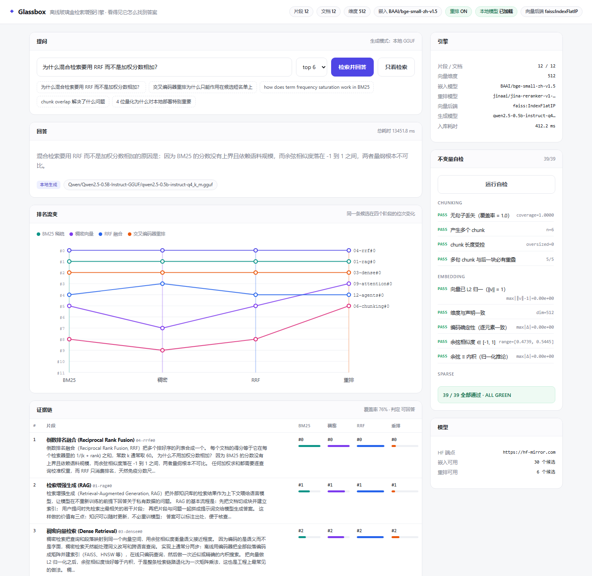

# Glassbox

**全离线 · 玻璃盒式检索增强生成引擎 —— 它不只给答案，还给「它是怎么找到这个答案的」。**

> 几乎所有 RAG demo 都是个黑盒：你敲一个问题，一段文字浮出来，你无从知道检索器到底召回了什么，
> 还是模型干脆自己编了一段。
>
> Glassbox 站在相反的前提上：**检索的每一步都必须可测量、可解释、可验证。**
> 稀疏排名、稠密排名、融合过程、重排打分、以及"证据够不够"的判定，全部摊开给你看。

纯 CPU 可跑，不需要 GPU，不需要 API key，不需要联网推理。中文英文同样支持。



> 上图是真实运行截图：`为什么混合检索要用 RRF 而不是加权分数相加？` 的完整回答，
> 附带排名流变图（同一条候选在四个阶段之间的位次变化）和证据链表。

---

## 目录

- [为什么是「玻璃盒」](#为什么是玻璃盒)
- [流水线](#流水线)
- [快速开始](#快速开始)
- [逐阶段原理](#逐阶段原理)
- [自我纠错循环](#自我纠错循环)
- [不变量自检](#不变量自检)
- [命令行](#命令行)
- [配置](#配置)
- [设计取舍](#设计取舍)
- [实测结果](#实测结果)
- [目录结构](#目录结构)

---

## 为什么是「玻璃盒」

一套生产级 RAG 的真实配方是：**混合检索 → 排名融合 → 交叉编码器重排 → 生成**。
每一步都可能悄悄坏掉，而且坏掉的方式各不相同：

| 症状 | 真实原因 | 只看最终答案能看出来吗 |
|---|---|---|
| 答案看起来合理但不对 | 召回阶段根本没找到正确片段 | ❌ 看不出来 |
| 专有名词/编号查不到 | 纯向量检索把罕见串平滑掉了 | ❌ 看不出来 |
| 换一种说法就查不到 | 只有 BM25，没有语义召回 | ❌ 看不出来 |
| 片段对了但答案不对 | 重排把正确段落挤出了上下文窗口 | ❌ 看不出来 |
| 首轮跑偏后没有第二次机会 | 没有相关性判定，硬答 | ❌ 看不出来 |

Glassbox 把每一条都变成**可见的数字**写在界面上：

- 每个候选在 **BM25 / 稠密 / RRF / 重排** 四个阶段的**排名与得分**
- 一张**排名流变图**，画出同一条候选如何在四个阶段之间上下移动
- **词项覆盖率**——判定"证据够不够"的透明信号
- **自我纠错循环**的每一轮：原始查询、改写后的查询、覆盖率、判定

---

## 流水线

```
                        ┌──────────────── 索引期 ────────────────┐
   文档 (.md/.txt/.pdf)  │  句子感知分块（带重叠）                  │
        │                │      ↓                                 │
        └───────────────>│  稠密编码 ONNX  ──> FAISS IndexFlatIP   │
                         │  分词 CJK 二元  ──> BM25 倒排            │
                         └────────────────────────────────────────┘

                        ┌──────────────── 查询期 ────────────────┐
   查询 ──┬──> BM25 稀疏检索 ──────────┐                          │
          │                             ├──> RRF 融合 ──> 交叉编码器 │
          └──> 稠密向量检索 ────────────┘     (k=60)      重排        │
                                                             │      │
                                          相关性判定 <───────┘      │
                                    (覆盖率 + 最高分)               │
                                              │                    │
                           不足 ──> 改写查询 ──┘  充足 ──> 生成     │
                          (LLM 重写 或 PRF 伪相关反馈)              │
                         └────────────────────────────────────────┘
```

---

## 快速开始

```bash
git clone https://github.com/CJX0712/glassbox.git
cd glassbox

# Windows
run.bat

# macOS / Linux
./run.sh
```

浏览器打开 <http://127.0.0.1:8765>。首次运行会自动建虚拟环境、装依赖、索引内置的 12 篇演示语料。

> 默认端口是 **8765**。Windows 上 8000–8123 常常落在 Hyper-V / WinNAT 的**保留区间**里
> （表现为 `WinError 10013`，看着像程序 bug，其实是系统拒绝绑定）。
> `glassbox serve` 会先试你要的端口，绑不上就自动回退到 8765 / 8801 / 9000 等。

想连本地生成模型一起装（可选，约 400 MB）：

```bash
run.bat --with-llm        # Windows
./run.sh  --with-llm      # macOS / Linux
```

手动安装：

```bash
python -m venv .venv
.venv/Scripts/pip install -r requirements.txt      # Windows
.venv/bin/pip     install -r requirements.txt      # macOS / Linux
.venv/Scripts/pip install -e .
.venv/Scripts/python -m glassbox serve
```

> **没有本地模型也能完整跑通。** 检索链路完全不受影响，只是回答退化为
> **基于检索的摘录（grounded extract）**，并在界面上明确标注模式。这是刻意的设计：
> 检索与生成解耦，缺任何一半都不该让另一半失效。

---

## 逐阶段原理

### 1. 分块 Chunking

按固定字符数硬切会把句子拦腰截断，而答案往往恰好落在断点上。
`glassbox/text.py` 先把文本切成完整句子，再按窗口装填，并保留一段**重叠**。

可验证的性质：**分块不丢句子**——把全部 chunk 拼起来，原文每一句都能在其中找到。
这条不变量由自检强制执行。

### 2. 稀疏检索 BM25

`rank_bm25` 实现的标准 Okapi BM25。中文的关键在分词：按空格切毫无意义。
Glassbox 用**字符二元组**近似中文分词（`玻璃盒` → `玻 / 玻璃 / 璃盒 / 盒`），
零成本恢复大部分检索信号。

BM25 是唯一能在**产品型号、错误码、罕见人名**上稳定命中的一环——稠密向量会把它们平滑掉。

### 3. 稠密检索

用 **fastembed** 跑 ONNX 版 `BAAI/bge-small-zh-v1.5`（512 维，仅 90 MB）。
刻意不用 sentence-transformers：同样跑 ONNX 推理，装 PyTorch 是 2.5 GB，装 ONNX Runtime 是 60 MB，
而且常驻内存低到能和本地大模型共存。

向量做 L2 归一化后，**余弦相似度严格等于内积**，整条稠密检索退化为一次矩阵乘法。
这条恒等式由自检逐元素验证。

### 4. 排名融合 RRF

不按分数加权求和，而用 **Reciprocal Rank Fusion**：

```
RRF(d) = Σ_r  1 / (k + rank_r(d))          k = 60
```

**为什么不加权求和？** 因为 BM25 分数无上界且随语料规模变化，余弦相似度落在 `[-1, 1]`，
两者量纲根本不可比。任何加权求和都要逐查询校准权重；RRF 只消费**排名**，
天然免疫分数尺度问题。常数 `k` 压制最靠前几位的影响，让单个检索器无法独断结果。

自检直接验证 RRF 的闭合形式、去重行为和单调性。

### 5. 交叉编码器重排

前两段都是"查询和段落各自独立编码"，彼此从未见面。**交叉编码器**把查询和一段候选
拼在一起送进 Transformer，输出一个相关性分数——精度高得多，也慢得多，
所以只作用在一个很短的小名单上。这就是「先检索、后重排」两段式结构存在的原因。

### 6. 生成

本地 GGUF 模型经 **llama.cpp** 在 CPU 上流式生成（默认 Qwen2.5-0.5B-Instruct，4 位量化约 400 MB）。
提示词强制模型**只依据编号上下文作答**并给出 `[n]` 引用；上下文不足时要明确说"不知道"。

---

## 自我纠错循环

朴素 RAG 是单向的：检索一次，生成一次。Glassbox 把它变成闭环。

**相关性判定**用的是两个**透明**信号，而不是让模型自己说"我有没有把握"：

```
覆盖率 = |查询实词 ∩ 上下文词项| / |查询实词|
判定 = 覆盖率 ≥ 60%  且  最高稠密相似度 ≥ 0.25  且  最高重排分 ≥ 阈值
```

实词 = 拉丁词 + 中文二元组（去掉停用词）。

判定为「不足」时改写查询，两条路都完全离线可用：

- **有本地模型**：让模型重写——保留实体、补同义词、去冗余；
- **没有本地模型**：**伪相关反馈（pseudo-relevance feedback）**——
  从当前排最前的段落里提取"高频且查询中没有"的词追加到查询上。
  这是信息检索里的经典技巧（Rocchio / RM3 一脉），零成本、零依赖。

闭环的价值是**容错**：单次检索的失误不会直接变成错误答案，系统还有第二轮机会。

---

## 不变量自检

`glassbox.selftest` 里每一条都是**可被独立实现交叉验证**的性质，不是"看起来对"。
界面上一键运行，或 `python -m glassbox selftest`。

<details>
<summary><b>展开完整不变量清单</b></summary>

| 组 | 不变量 |
|---|---|
| 分块 | 无句子丢失（覆盖率 = 1.0）；产生多个 chunk；单块长度受控；多句 chunk 与后一块必有重叠 |
| 嵌入 | 向量 L2 归一（‖v‖ = 1）；维度与声明一致；编码确定性（逐元素一致）；余弦 ∈ [-1,1]；**余弦 ≡ 内积** |
| 稀疏 | **BM25 对词频严格递增**；**BM25 命中解析闭合形式**（误差 < 1e-9）；无关文档得分为 0；非负得分；混合分词（CJK 二元 + 拉丁词） |
| 融合 | **RRF 闭合形式 1/(k+rank+1)**；双榜第一必居融合榜首；重复 id 只计一次；融合顺序分数单调不增 |
| 索引 | 入库产生 chunk；向量库后端就绪；**FAISS 与暴力搜索返回同一批邻居**；得分一致 |
| 检索 | 最终结果数 = top_k；final_rank 连续从 0 开始；每个命中都留有阶段证据；证据链四阶段俱全；语义查询命中正确文档；跨语言查询由稠密阶段兜底；**检索确定性** |
| 循环 | 产生尝试记录；grade 含覆盖率与决策；覆盖率 ∈ [0,1] |
| 重排 | 重排器可运行；重排确定性；**重排把最相关段落排到第一** |
| 生成 | **自动线程数落在 2-4 区间**；不超过逻辑核数；LLM 可加载或已优雅降级；无模型时仍有 grounded 摘录答案 |

其中四条特别值得一提：

1. **FAISS vs 暴力搜索** —— 同一批向量，两条完全独立的实现路径必须返回同样的邻居。
   出现分歧时，你能立刻知道是**哪一条**错了，而不是笼统地"检索不准"。
2. **BM25 解析闭合形式** —— 语料是等长的，所以长度归一化项恰好抵消，分数应当严格等于
   `idf · tf(k₁+1) / (tf + k₁)`。自检逐项比对到 `5.6e-17`。
   这里有个**测试本身的坑**值得写下来：早先的语料里查询词出现在 4 篇中的 3 篇，
   IDF 为负；`rank_bm25` 用 `0.25 × 平均IDF` 兜底，而那批语料的平均 IDF 恰好是 0.0，
   于是**所有分数被抹平成 0，断言恒真、测试空转**。换成稀有词（7 篇中 3 篇、
   等长句）之后它才真正开始验证东西。
3. **余弦 ≡ 内积** —— 归一化的直接推论。这条一旦不成立，说明归一化没生效，
   而下游所有基于内积的加速都会静默出错。
4. **自动线程数 ∈ [2, 4]** —— 把上面那张「4 线程比 16 线程快 4 倍」的表钉成回归测试。

</details>

---

## 命令行

```bash
python -m glassbox serve                    # 启动 Web UI（默认 :8765，占用则自动回退）
python -m glassbox ask "为什么用 RRF"        # 一次性提问
python -m glassbox retrieve "RRF"            # 只检索，打印完整证据链
python -m glassbox ingest ./my-notes         # 索引一个目录或单个文件
python -m glassbox selftest                  # 跑不变量自检
python -m glassbox download-model            # 下载本地 GGUF
python -m glassbox models                    # 列出可用模型
```

`retrieve` 的输出把四个阶段的证据排成一张表：

```
Q  为什么混合检索要用 RRF 而不是加权分数相加
   R0 coverage=0.62 decision=answer

#  uid                  BM25    dense       RRF    rerank  title
------------------------------------------------------------------
1  04-rrf#0                1        1  0.032787      8.42  倒数排名融合
2  03-dense#1              4        2  0.024390      2.11  稠密向量检索
...
```

---

## 配置

全部通过环境变量覆盖，无需改代码：

| 变量 | 默认 | 说明 |
|---|---|---|
| `GLASSBOX_CHUNK_CHARS` | `700` | 分块目标长度（字符） |
| `GLASSBOX_CHUNK_OVERLAP` | `180` | 相邻块重叠（字符） |
| `GLASSBOX_RRF_K` | `60` | RRF 常数 |
| `GLASSBOX_TOPK` | `8` | 最终返回片段数 |
| `GLASSBOX_FANOUT` | `30` | 每个首段检索器交给融合的候选数 |
| `GLASSBOX_MAX_REWRITES` | `2` | 自我纠错最大轮数 |
| `GLASSBOX_EMBED_MODEL` | 自动 | 强制指定嵌入模型 |
| `GLASSBOX_RERANK_MODEL` | 自动 | 强制指定重排模型 |
| `GLASSBOX_DISABLE_RERANK` | – | 设为 `1` 关闭重排 |
| `GLASSBOX_LLM_REPO` / `_FILE` | Qwen2.5-0.5B GGUF | 生成模型 |
| `GLASSBOX_LLM_THREADS` | `0`（自动 = 2–4） | 生成线程数，别调大，见[实测结果](#生成吞吐线程数是个大坑) |
| `GLASSBOX_DATA` | `./.glassbox` | 索引与模型的存放目录 |
| `HF_ENDPOINT` | `https://hf-mirror.com` | 模型下载端点 |

模型是**自适应选择**的：`glassbox.config` 在运行时枚举当前 fastembed 实际支持的模型，
按「多语言/中文优先」的顺序挑第一个可用的。换成 `jinaai/jina-reranker-v2-base-multilingual`
只需要一个环境变量。

---

## 设计取舍

| 决定 | 原因 |
|---|---|
| **fastembed（ONNX）而非 sentence-transformers（PyTorch）** | 装包从 2.5 GB 降到 60 MB；CPU 推理更省内存，能和本地 LLM 共存 |
| **RRF 而非加权分数求和** | BM25 无上界、余弦有界，量纲不可比；RRF 只用排名，免校准 |
| **交叉编码器重排而非只靠向量** | 联合编码精度远高于双塔，但只能跑短名单——所以放在第二段 |
| **BM25 用 CJK 二元分词** | 中文无空格，按空格切会让 BM25 退化成整句精确匹配 |
| **完整性度量用词项覆盖率而非 LLM 自评** | 可解释、确定性、零成本，且没有本地模型时依然可用 |
| **伪相关反馈作为 LLM 改写的降级路径** | 让自我纠错循环在完全离线时仍然成立 |
| **检索与生成解耦** | 缺任何一半都不该让另一半失效；没有 LLM 时依然是有用的检索工具 |
| **FAISS 与 numpy 双路并存** | 两条独立实现互为对照，是排查检索 bug 的唯一可靠手段 |
| **生成线程锁在 2–4** | 小模型瓶颈在内存带宽；线程给满反而慢 4 倍（有实测表），还占着机器 |
| **默认端口 8765 而非 8000** | Windows 上 8000–8123 常被 Hyper-V/WinNAT 保留，绑定失败看着像程序 bug |

---

## 实测结果

本机实测环境：**AMD Ryzen 7（8 核 16 线程）/ 16 GB RAM / Windows 11 / 纯 CPU，无 GPU**。
以下数字全部可复现，命令写在每张表下面。

### 检索链路

| 指标 | 实测 |
|---|---|
| 全量重建索引（12 篇 → 12 块，512 维） | **924 ms**（稠密编码 910 / FAISS 建库 0.1 / BM25 建库 4.4） |
| 检索 · 单轮（四阶段全跑） | **中位 637 ms**（区间 484 – 774） |
| 检索 · 触发 2 轮改写 | **9.5 s** |
| 不变量自检（39 条） | **6.2 – 7.5 s** |
| 端到端提问（检索 + 改写 + 生成） | **13 – 15 s** |

```bash
python -m glassbox retrieve "为什么混合检索要用 RRF"    # 看单轮耗时
python -m glassbox selftest                            # 39/39
```

「单轮」跑完 BM25 → 稠密 → RRF → 交叉编码器重排四段；「触发改写」说明这一问
被判定为证据不足，多花了两轮 LLM 改写——**这是设计换来的时间**，不是性能事故：
拿 ~9 秒的容错去换"首轮跑偏就直接给出错误答案"。

### 生成吞吐：线程数是个大坑

Qwen2.5-0.5B-Instruct-Q4_K_M，llama.cpp CPU 推理，96 token 取两次最好值：

| 线程数 | 2 | **4** | 6 | 8 | 12 | 16 |
|---|---|---|---|---|---|---|
| tok/s | 32.3 | **32.5** | 25.6 | 23.6 | 25.1 | **8.2** |

**`cpu_count() - 1` 是错的默认值。** 16 线程的机器上它会选 15 线程，正好落在
那张表最差的一格：**8 tok/s**，比 4 线程慢 **4 倍**。原因很直白——0.5B 的量化模型
瓶颈在内存带宽而不在算力，多出来的线程只在抢总线。

`glassbox.llm.auto_threads()` 因此把线程锁在 2–4；这条性质由自检强制执行
（`自动线程数落在 2-4 区间`），免得哪天被「优化」回去。副作用是机器上还留得下
12 个空闲线程跑你自己的东西。

### 内存占用

| 组件 | 常驻 |
|---|---|
| 嵌入模型（bge-small-zh-v1.5，ONNX） | ~90 MB |
| 重排模型（jina-reranker-v1-turbo-en） | ~150 MB |
| 生成模型（Qwen2.5-0.5B Q4_K_M） | ~470 MB |
| 索引（FAISS + BM25，随语料线性增长） | 演示语料下 < 1 MB |

三者共存仍在 1 GB 以内，这是刻意选小模型 + ONNX 而非 PyTorch 的结果。

---

## 目录结构

```
glassbox/
├── glassbox/
│   ├── config.py         # 路径、模型注册表、自适应选型
│   ├── text.py           # 归一化、句子感知分块、CJK 分词
│   ├── documents.py      # 目录 / 文件 / PDF 载入
│   ├── embed.py          # fastembed ONNX 稠密编码
│   ├── sparse.py         # BM25 稀疏检索
│   ├── fusion.py         # RRF 融合
│   ├── rerank.py         # 交叉编码器重排
│   ├── store.py          # FAISS + numpy 双路向量库
│   ├── llm.py            # llama.cpp 本地生成
│   ├── pipeline.py       # 玻璃盒流水线 + 自我纠错循环
│   ├── selftest.py       # 不变量自检套件
│   ├── sample_corpus.py  # 内置双语演示语料
│   ├── api.py            # FastAPI + SSE
│   └── cli.py            # 命令行
├── static/index.html     # 单文件前端（零外部依赖）
├── scripts/
│   ├── seed_corpus.py    # 从内置语料生成 corpus/
│   └── smoke_http.py     # 端到端 HTTP 冒烟（对着跑起来的服务打）
├── docs/ui.png           # 截图
├── corpus/               # 放你自己的文档
├── run.bat / run.sh
└── requirements.txt
```

端到端验证（需要服务已在跑）：

```bash
python -m glassbox serve &
python scripts/smoke_http.py            # bootstrap / 四阶段证据 / SSE / 自检
```

它检查的是**接缝**而不是单个函数：索引真的建起来了、检索返回的四段证据齐全、
SSE 真的在流、引用真的带回来了、39 条不变量在服务进程里也全绿。任何一条断了都返回非零退出码。

---

## License

MIT © 晨星
